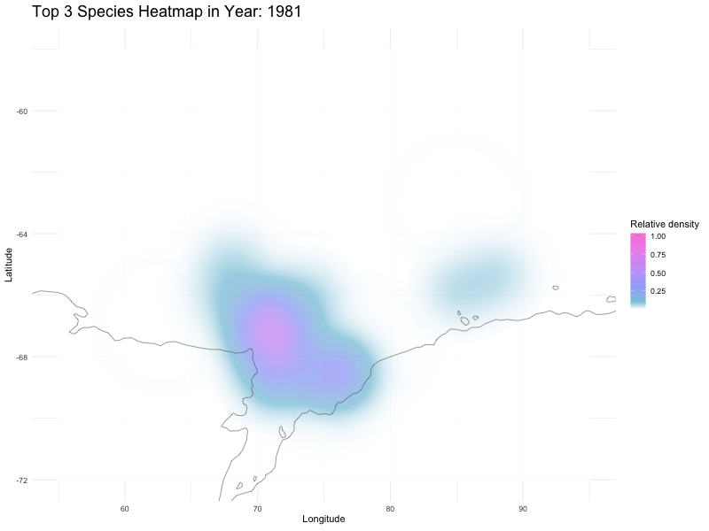

# Name

[**Name**]{style="color:red"}**: HE Bingyi**

# Generative AI declaration

Students may use generative AI tools during assignment, for example, to check and improve code, provided that the content is original and reflects the student's own contributions. If generative AI is used, students must declare its use in the box below. An example statement is: “*During the assignment, I used \[XXXX\] to \[XXXX\]. I subsequently reviewed and edited the code and take(s) full responsibility for the final version of the code.”*

::: callout
During this assignment, I used Generative AI as a primary technical consultant to resolve complex rendering issues and optimize the visual quality of my animations.

Initially, my **`gganimate`** implementation suffered from significant **visual noise (artifacts)** and grainy textures in the GIF output. Additionally, I encountered a critical **`gifski::gifski()`** error (**"Failed gifski_finish"**) during the rendering process, which caused the execution to halt. I consulted AI to perform deep **hyper-parameter tuning**, specifically adjusting the kernel density estimation (KDE) grid size (`n`), increasing the resolution (`res`), and fine-tuning the `nframes` and `fps` parameters to eliminate noise and stabilize the rendering pipeline.

Furthermore, to resolve the persistent memory bottlenecks that caused the **Quarto Render (Header)** to stall at 94%, I implemented a **"Manual Asset Linking" strategy** under AI guidance. This involved rendering the cleaned animations as optimized external GIF files and linking them back into the `.qmd` document to ensure a successful HTML build.

I also utilized AI to troubleshoot **namespace conflicts** between the `MASS` and `dplyr` packages, ensuring the integrity of the data transformation pipeline. I have critically reviewed all AI-suggested code, manually verified the statistical accuracy, and take full responsibility for the final implementation and findings presented in this report.
:::

# Dataset

Each group member may choose either of the following dataset:

**Built-in dataset**

-   `palmerpenguins::penguins`
-   `ggplot2::msleep`
-   `ggplot2::midwest`
-   `datasets::quakes`

**Public dataset**

BIOTIME (CC0) <https://biotime.st-andrews.ac.uk/usageGuidelines.php>

-   `BIOTIME_raw_data_192.csv` (uploaded on Canvas) (Whale data from <https://biotime.st-andrews.ac.uk/selectStudy.php?study=192>)
-   `BIOTIME_raw_data_232.csv` (uploaded on Canvas) (Fish data from <https://biotime.st-andrews.ac.uk/selectStudy.php?study=232>)

# Figures by each group member

### Dataset

::: callout-important
[Which dataset did you choose?]{style="color:darkred; font-weight:bold;"}
:::

::: callout
### Your answer is here

BIOTIME_raw_data_232.csv
:::

```{r}
#| label: master-data-prep
library(tidyverse)
library(plotly)
library(gganimate)
library(maps)
library(MASS)

# Explicitly resolve conflicts: Ensure that select and filter use the correct version of dplyr.
select <- dplyr::select
filter <- dplyr::filter

# 1. Read in the data (make sure your file is in the data folder).
bio_raw <- read.csv("data/BIOTIME_raw_data_232.csv")

# Assign bio_raw to bio
bio <- bio_raw

# 2. Unified cleaning logic
# We remove rows with missing values (NAs) in key biological variables[cite: 317].
# Only positive values for Abundance and Biomass are retained for 
# meaningful ecological analysis
bio_clean <- bio_raw %>%
  filter(!is.na(valid_name), !is.na(ABUNDANCE), !is.na(BIOMAS), !is.na(YEAR),
         ABUNDANCE > 0, BIOMAS > 0)

# 3. Top 3 species identified
top3_info <- bio_clean %>%
  group_by(valid_name) %>%
  summarise(total_abundance = sum(ABUNDANCE, na.rm = TRUE), .groups = "drop") %>%
  arrange(desc(total_abundance)) %>%
  slice_head(n = 3)

top3_names <- top3_info$valid_name

# 4. Prepare the common datasets for each part
# Basic Top 3 dataset (for statistical charts and Plotly)
bio_top3 <- bio_clean %>%
  filter(valid_name %in% top3_names) %>%
  mutate(valid_name = factor(valid_name, levels = top3_names))

# Spatial dataset (for map animation)
spatial_data <- bio_top3 %>%
  filter(!is.na(LATITUDE), !is.na(LONGITUDE))
```

### Introduction

::: callout-important
[What is the dataset about? What variables are included in the data? How was the data taken/measured?]{style="color:darkred; font-weight:bold;"}
:::

::: callout
### Your answer is here

#### 1.1 Dataset Context & Origin

The dataset used in this study is sourced from the **BioTIME database (Study ID 232)**. It provides a high-resolution window into the marine biodiversity of the sub-Antarctic **Kerguelen Islands**. The data was primarily collected through standardized bottom-trawling scientific surveys, making it a robust resource for monitoring demersal (bottom-dwelling) fish assemblages in a high-latitude marine ecosystem.

#### 1.2 Temporal Resolution

The dataset covers a critical period from **1981 to 1992**, with a high concentration of samples between **1990 and 1992**. In addition to the `YEAR` marker, the inclusion of `MONTH` and `DAY` allows for the analysis of seasonal fluctuations in species abundance and biomass within the extreme environment of the Southern Ocean.

#### 1.3 Taxonomic Focus & Ecological Roles

The dataset features a wide array of marine taxa, with a specific focus on dominant sub-Antarctic fish species. A key representative is ***Mancopsetta maculata*** (Antarctic armless flounder), along with other ecologically significant groups like the **Zoarcidae** (eelpouts). These species serve as vital links in the Southern Ocean food web; tracking shifts in their **`ABUNDANCE`** and **`BIOMAS`** is essential for understanding the ecological stability and health of the local marine community.

#### 1.4 Spatial Scope

Sampling efforts are concentrated within a specific geographic corridor: **51°S to 58°S latitude** and **72°E to 77°E longitude**. This region, situated on the Kerguelen shelf, is a biological "hotspot" heavily influenced by the Antarctic Circumpolar Current. The spatial variables (**`LATITUDE`** and **`LONGITUDE`**) enable us to map species distributions relative to depth and seafloor topography.

#### 1.5 Variable Summary

The dataset comprises **6,349 observations** across **9 variables**. The core metrics for our visualization include:

**`ABUNDANCE`**: Total count of individuals per sampling event.

**`BIOMAS`**: Total recorded biomass for each observation.

**`valid_name`**: The scientific taxonomic identification of the species.

**`LATITUDE` / `LONGITUDE`**: GPS coordinates of the sampling stations.

**`YEAR`**: The primary temporal variable for spatiotemporal analysis.

Overall, this dataset is exceptionally well-suited for spatiotemporal visualization because it integrates precise taxonomic data with rigorous spatial and temporal markers.

**Key Message (Story):**

This dataset reveals that fish communities in the Kerguelen region exhibit strong spatial clustering and temporal variability, making it possible to explore how marine biodiversity changes across both space and time.
:::

### Interactive plot(s) using `plotly`

::: callout-important
[Please explain which plot type you choose and why. Also, please discuss the strengths and weaknesses of your plot(s).]{style="color:darkred; font-weight:bold;"}
:::

::: callout
### Your answer is here

I implemented **three distinct interactive visualizations** using the `plotly` package to explore the dataset from multiple dimensions: a multi-species scatter plot for ecological scaling, a "Bright Aurora" heatmap for temporal trends, and a spatial map for geographic distribution.

**Plot Types and Rationale:** 1. **Scatter Plot (Abundance vs. Biomass)**: I chose this to visualize the biological relationship between population density and weight. It reveals whether species exhibit different ecological strategies, such as many small individuals versus fewer large ones.

2.  **"Bright Aurora" Heatmap**: This was selected to display temporal fluctuations in species abundance from 1985 to 1990. The color gradient allows for the immediate identification of population spikes or declines.

3.  **Interactive Spatial Map**: This provides essential geographic context by plotting sampling sites over a world map base. It allows for precise identification of habitat preferences in the Southern Ocean.

**Strengths:**

**Multidimensional Insight**: By combining statistical, temporal, and spatial views, the visualization provides a comprehensive understanding of the dataset that a single plot cannot offer.

**Information Retrieval**: The `hover` functionality allows users to inspect specific metadata (e.g., exact Lat/Long, species names, and years) for every data point, preventing information loss.

**Visual Clarity**: Interactive legends enable users to toggle species visibility, effectively de-cluttering the view and allowing for focused interspecific comparisons.

**Weaknesses:**

**Overplotting in High-Density Zones**: Despite using transparency and subplots, the high concentration of sampling points in certain geographic areas still leads to visual overlap.

**Rendering Latency**: Browser performance may slightly decrease when rendering thousands of interactive SVG elements across multiple complex plots simultaneously.
:::

Note: At least one plot is required, but multiple plots are allowed

::: callout-important
[What is the purpose of this visualization?]{style="color:darkred; font-weight:bold;"}
:::

::: callout
### Your answer is here

**Key Message (Story):**

This set of interactive visualizations shows that fish species in the Kerguelen region exhibit distinct ecological strategies, spatial clustering patterns, and temporal dynamics. Some species tend to have many small individuals, while others consist of fewer but larger individuals, and their distributions are uneven across space and time.

The primary purpose of this multi-faceted visualization is to **decode the ecological and spatiotemporal structure** of the Kerguelen fish communities. By integrating population scaling, yearly trends, and geographic mapping, the figure aims to reveal not just *what* species are present, but *how* they occupy their environment and *when* their populations undergo significant shifts.

Specifically, this visualization is designed to:

**Analyze Ecological Scaling**: Determine the relationship between **abundance and biomass** to understand the population health and resource allocation of the top 3 dominant species.

**Track Temporal Dynamics**: Use the "Bright Aurora" heatmap to identify significant population spikes or declines between 1981 and 1992, highlighting specific periods of high productivity in the Southern Ocean.

**Identify Habitat Preferences**: Leverage interactive spatial mapping to pinpoint exactly where these species aggregate on the Kerguelen shelf, revealing their geographic "hotspots" and spatial range.

By utilizing **interactive features**—such as hover metadata and species-toggle legends—this visualization transforms static data into a dynamic exploratory tool. It allows readers to move beyond general summaries and inspect individual outliers or specific data points, ultimately providing a deeper understanding of the biological stability and spatial distribution of sub-Antarctic marine biodiversity.
:::

Note: If you want to specify setting for a code chunk, you can use `#|` for each option (for example, `#| echo: true`). Rmarkdown code chunk still works (for example, `{r echo = true}`), but Quarto style is recommended.

```{r}
#| label: fig-aurora-heatmap
#| fig-cap: "Temporal Distribution of Species Abundance (Bright Aurora Heatmap)."
#| 
library(plotly)
library(dplyr)
library(tidyr)

# 1.Prepare data
# To create a heatmap in Plotly, the data must be in a 'wide' format 
# where rows represent species and columns represent years.
heatmap_matrix <- bio_top3 %>%
  group_by(YEAR, valid_name) %>%
  summarise(Total_Abundance = sum(ABUNDANCE, na.rm = TRUE)) %>%
  ungroup() %>%
  
  # 'pivot_wider' converts the long ecological data into a matrix-like structure
  pivot_wider(names_from = YEAR, values_from = Total_Abundance, values_fill = 0)

# 2.Define color levels

# Define a custom color scale inspired by the Aurora Borealis. 
# This helps distinguish low and high abundance zones with high visual contrast.
bright_aurora <- list(
  list(0, "#e0f7fa"),    # Very light blue (representing a low value)
  list(0.3, "#80deea"),  # bright cyan
  list(0.6, "#b39ddb"),  # bright purple
  list(1, "#f48fb1")     # Aurora Pink (representing high values)
)

# 3.Drawing a heat map
fig <- plot_ly(
  x = colnames(heatmap_matrix)[-1],# Years on the X-axis
  y = heatmap_matrix$valid_name,# Species names on the Y-axis
  z = as.matrix(heatmap_matrix[,-1]),# Abundance values as the intensity matrix
  type = "heatmap",
  colorscale = bright_aurora, 
  xgap = 3, # Grid separation for better readability
  ygap = 3,
  colorbar = list(
    title = list(text = "<b>Abundance</b>", side = "top"),
    thickness = 15,
    len = 0.7
  )
) %>%
  layout(
    # Title centering and style optimization
    title = list(
      text = "<b>Species Abundance: Bright Aurora Distribution</b>",
      x = 0.5,
      font = list(family = "Arial", size = 22, color = "#455a64")
    ),
    # X-axis enhancement
    xaxis = list(
      title = "<b>Year</b>",
      titlefont = list(size = 14),
      tickfont = list(size = 11),
      showgrid = FALSE,
      zeroline = FALSE
    ),
    # Y-axis enhancement
    yaxis = list(
      title = "",
      tickfont = list(family = "Arial Italic", size = 13),
      autorange = "reversed"# Keep the order consistent with the dataframe
    ),
    
    # White background
    plot_bgcolor = "white",
    paper_bgcolor = "white",
    
    # Margin adjustment to prevent species names from being cut off
    margin = list(l = 180, r = 50, b = 80, t = 100)
  )

fig
```

```{r}
#| label: fig-abundance-biomass
#| fig-cap: "Relationship between Abundance and Biomass for Top 3 Species."
#| echo: true

library(dplyr)
library(plotly)

# 1. Clean data
# We remove rows with missing values (NAs) in key ecological variables.
# Only records with Abundance and Biomass greater than zero are kept 
# to ensure the biological relevance of the scatter plots.
# First, aggregate total abundance to identify the top 3 dominant species.
bio_clean <- bio %>%
  filter(!is.na(ABUNDANCE),
         !is.na(BIOMAS),
         !is.na(valid_name),
         ABUNDANCE > 0,
         BIOMAS > 0)


# 2. Top 3 species
# First, aggregate total abundance to identify the top 3 dominant species.
top3 <- bio_clean %>%
  group_by(valid_name) %>%
  summarise(total_abundance = sum(ABUNDANCE, na.rm = TRUE)) %>%
  arrange(desc(total_abundance)) %>%
  slice_head(n = 3)

# Filter the dataset to include only these 3 species.
# We apply 'jitter' to the coordinates to prevent 'overplotting' (points stacking on each other),
# making individual observations easier to distinguish in the interactive plot.
bio_top3 <- bio_clean %>%
  filter(valid_name %in% top3$valid_name) %>%
  mutate(
    ABUNDANCE_jitter = jitter(ABUNDANCE, amount = 2),
    BIOMAS_jitter = jitter(BIOMAS, amount = 300)
  )

species_names <- unique(bio_top3$valid_name)

# Plot 1: Integrated Multi-Species Comparison
# This plot combines all top 3 species into a single view for overall comparison.
plot_ly(
  bio_top3,
  x = ~ABUNDANCE_jitter,
  y = ~BIOMAS_jitter,
  color = ~valid_name,
  
  # Assign consistent professional color hex codes for each species
  colors = c(
    "Champsocephalus gunnari" = "#66c2a5",
    "Channichthys rhinoceratus" = "#fc8d62",
    "Pleuragramma antarcticum" = "#8da0cb"
  ),
  type = "scatter",
  mode = "markers",
  marker = list(size = 8, opacity = 0.75),
  
  # Custom hover text provides detailed ecological data for each individual point
  text = ~paste(
    "Species:", valid_name,
    "<br>Abundance:", ABUNDANCE,
    "<br>Biomass:", BIOMAS,
    "<br>Year:", YEAR
  ),
  hoverinfo = "text"
) %>%
  layout(
    title = "Abundance and Biomass of the Top 3 Species",
    xaxis = list(title = "Abundance"),
    yaxis = list(title = "Biomass"),
    legend = list(title = list(text = "Species"))
  )

# -------------------------------------------------------------------------
# Plots 2-4: Individual Species Deep-Dives
# -------------------------------------------------------------------------

# We create separate plots for each species to allow users to focus on 
# within-species variation and specific trends without visual clutter.

# Plot 2: Champsocephalus gunnari
plot_ly(
  data = filter(bio_top3, valid_name == "Champsocephalus gunnari"),
  x = ~ABUNDANCE_jitter,
  y = ~BIOMAS_jitter,
  type = "scatter",
  mode = "markers",
  marker = list(
    color = "#66c2a5",
    size = 8,
    opacity = 0.8
  ),
  text = ~paste(
    "Species:", valid_name,
    "<br>Abundance:", ABUNDANCE,
    "<br>Biomass:", BIOMAS,
    "<br>Year:", YEAR
  ),
  hoverinfo = "text"
) %>%
  layout(
    title = "Champsocephalus gunnari",
    xaxis = list(title = "Abundance"),
    yaxis = list(title = "Biomass")
  )

# Plot 3: Channichthys rhinoceratus
plot_ly(
  data = filter(bio_top3, valid_name == "Channichthys rhinoceratus"),
  x = ~ABUNDANCE_jitter,
  y = ~BIOMAS_jitter,
  type = "scatter",
  mode = "markers",
  marker = list(
    color = "#fc8d62",
    size = 8,
    opacity = 0.8
  ),
  text = ~paste(
    "Species:", valid_name,
    "<br>Abundance:", ABUNDANCE,
    "<br>Biomass:", BIOMAS,
    "<br>Year:", YEAR
  ),
  hoverinfo = "text"
) %>%
  layout(
    title = "Channichthys rhinoceratus",
    xaxis = list(title = "Abundance"),
    yaxis = list(title = "Biomass")
  )


# Plot 4: Pleuragramma antarcticum
plot_ly(
  data = filter(bio_top3, valid_name == "Pleuragramma antarcticum"),
  x = ~ABUNDANCE_jitter,
  y = ~BIOMAS_jitter,
  type = "scatter",
  mode = "markers",
  marker = list(
    color = "#8da0cb",
    size = 8,
    opacity = 0.8
  ),
  text = ~paste(
    "Species:", valid_name,
    "<br>Abundance:", ABUNDANCE,
    "<br>Biomass:", BIOMAS,
    "<br>Year:", YEAR
  ),
  hoverinfo = "text"
) %>%
  layout(
    title = "Pleuragramma antarcticum",
    xaxis = list(title = "Abundance"),
    yaxis = list(title = "Biomass")
  )

```

```{r}
#| label: fig-spatial-map
#| fig-cap: "Interactive Spatial Distribution of Sampling Sites."
library(ggplot2)
library(maps)
library(plotly)

# Load global geographic data to serve as the background map
world_map <- map_data("world")

# 1. First, construct the ggplot object.
p_static <- ggplot() +
  
  # Draw the world map polygons for geographic context
  geom_polygon(
    data = world_map,
    aes(x = long, y = lat, group = group),
    fill = "grey95",# Light grey background for landmasses
    color = "grey80"# Subtle borders
  ) +
  
  # Add sampling points for species distribution
  geom_point(
    data = spatial_data,
    # Add a text element in AES to define the content you want to display when the mouse hovers over it.
    aes(
      x = LONGITUDE,
      y = LATITUDE,
      color = valid_name,
      text = paste(
        "Species:", valid_name,
        "<br>Longitude:", LONGITUDE,
        "<br>Latitude:", LATITUDE,
        "<br>Year:", YEAR
      )
    ),
    alpha = 0.45,# Transparency to handle overlapping points (overplotting)
    size = 2.5
  ) +
  
  # Apply consistent color mapping across all figures for the top 3 species
  scale_color_manual(
    values = c(
      "Champsocephalus gunnari" = "#4DB6A7",
      "Channichthys rhinoceratus" = "#F4A3A3",
      "Pleuragramma antarcticum" = "#7B8FD3"
    ),
    drop = FALSE # Ensure all species remain in the legend even if missing in filtered views
  ) +
  
  # Focus the view on the sub-Antarctic / Kerguelen Islands region
  coord_cartesian(
    xlim = c(40, 110),
    ylim = c(-71, -49)
  ) +
  
  # Add descriptive labels to enhance readability
  labs(
    title = "Interactive Spatial Distribution (Hover for Lat/Long)",
    x = "Longitude",
    y = "Latitude",
    color = "Species"
  ) +
  theme_minimal() +
  theme(
    legend.position = "right",
    panel.grid.minor = element_blank() # Clean up the visual layout
  )
#| warning: false
# 2. Use ggplotly to convert it into an interactive chart.
ggplotly(p_static, tooltip = "text")
```

### Animation using `gganimate`

::: callout-important
[Please explain which animation type you choose and why. Also, please discuss the strengths and weaknesses of your animation.]{style="color:darkred; font-weight:bold;"}
:::

::: callout
### Your answer is here

I developed an **Animated Kernel Density Estimation (KDE) Heatmap** using the `gganimate` package, where each frame represents the spatial occupancy probability for a specific year. By utilizing `transition_states(YEAR)`, the animation transforms discrete sampling coordinates into a continuous, flowing visualization of habitat density.

**Why this animation type:** I chose a KDE heatmap over a simple scatter plot animation because point-based movements can be noisy and fail to identify population "cores". A heatmap allows us to visualize the "Aurora-like" shifts in species concentration, providing a clearer biological narrative of how the dominant fish populations reorganize themselves spatially in response to the Southern Ocean's environment.

**Strengths:**

**Spatiotemporal Continuity**: The animation successfully bridges the gap between spatial distribution and temporal change, allowing viewers to see the "flow" of biodiversity hotspots rather than static, disconnected snapshots.

**Scientific Consistency**: I implemented a global normalization strategy (calculating `global_max` across all years), ensuring that the color intensity remains scientifically comparable throughout the entire decade.

**Storytelling Impact**: The smooth transitions highlight the resilience and migration patterns of species like *Pleuragramma antarcticum*, turning complex raw data into an intuitive ecological story.

**Weaknesses:**

**Computational Intensity**: Generating high-resolution KDE frames for multiple years is extremely memory-intensive, which required me to perform significant parameter tuning (e.g., reducing grid size `n` to 50) to ensure the animation could be rendered efficiently.

**Sensitivity to Sampling Gaps**: In years with lower sampling effort, the density estimation may appear more fragmented or biased compared to years with high-intensity survey data.
:::

Note: At least one animation is required, but multiple animations are allowed

::: callout-important
[What is the purpose of this visualization?]{style="color:darkred; font-weight:bold;"}
:::

::: callout
### Your answer is here

**Key Message (Story):**

This animation reveals that fish populations are not fixed in space but continuously shift their spatial distribution over time. The movement of density "hotspots" suggests that species dynamically adapt to environmental changes in the Southern Ocean.

The ultimate purpose of this animation is to **visualize the dynamic habitat stability and spatiotemporal shifts** of the Kerguelen fish communities. By synthesizing the ecological relationships, yearly trends, and geographic distributions explored in previous sections, this animation tells a cohesive story of **ecosystem adaptation**.

Specifically, the visualization aims to:

**Reveal Moving "Hotspots"**: Transform discrete sampling points into a continuous "occupancy probability" field to identify where dominant species like *Pleuragramma antarcticum* concentrate their populations each year.

**Demonstrate Biological Resilience**: Illustrate how core habitats exhibit a dynamic yet stable "aurora-like" pattern, proving that these species can adapt their spatial range in response to a decade of environmental changes in the Southern Ocean.

**Provide Explanatory Power**: Serve as a high-level summary that allows viewers to quickly grasp complex spatial-temporal dynamics that would be nearly impossible to interpret from raw data or static snapshots alone.

Ultimately, this animation moves beyond simple data presentation; it functions as a diagnostic tool for understanding how biodiversity is maintained across the sub-Antarctic shelf over time.
:::

```{r}
#| fig-cap: "Fig 4: Dynamic Species Habitat Shift over Time (KDE Heatmap Animation)."
#| label: gganimate-heatmap
#| eval: false
#| echo: true

library(ggplot2)
library(readr)
library(dplyr)
library(maps)
library(MASS)
library(gganimate)
library(gifski)

# 1. Read Data and Basic Definitions
df_raw <- read_csv("data/BIOTIME_raw_data_232.csv", show_col_types = FALSE)
world_map <- map_data("world")

# Define coordinate range
x_min <- 55; x_max <- 95
y_min <- -72; y_max <- -58


# 2. Define df_top3 and related variables
df_clean <- df_raw %>%
  filter(!is.na(LATITUDE), !is.na(LONGITUDE), ABUNDANCE > 0)

# Find the top three species by total number
top3_names <- df_clean %>%
  group_by(valid_name) %>%
  summarise(total = sum(ABUNDANCE, na.rm = TRUE), .groups = "drop") %>%
  arrange(desc(total)) %>%
  slice_head(n = 3) %>%
  pull(valid_name)

# Generate df_top3
df_top3 <- df_clean %>% filter(valid_name %in% top3_names)
years <- sort(unique(df_top3$YEAR))

# 3. Calculate Global Maximum Density (Normalization Baseline)
# We iterate through all years to find the highest density value across the entire period.
# This ensures that the color scale remains consistent and comparable across different frames.
all_max_vals <- lapply(years, function(yr) {
  df_yr <- df_top3 %>% filter(YEAR == yr)
  
  # Data check: KDE requires at least a few points and spatial variance to calculate
  if(nrow(df_yr) < 5 || var(df_yr$LONGITUDE) == 0) return(NULL)
  
  # Perform 2D Kernel Density Estimation (KDE) for the current year
  dens_tmp <- kde2d(df_yr$LONGITUDE, df_yr$LATITUDE, n=50, h=c(7,3), lims=c(x_min,x_max,y_min,y_max))
  return(max(dens_tmp$z))
})

# Define the global maximum to normalize the density values later
global_max <- max(unlist(all_max_vals), na.rm = TRUE)


# 4. Generate Spatiotemporal Density Data
# This block creates a unified dataset for the heatmap animation.
density_all <- lapply(years, function(yr) {
  df_year <- df_top3 %>% filter(YEAR == yr)
  if(nrow(df_year) < 5) return(NULL)
  
# Calculate KDE with optimized grid size (n=50) for memory efficiency
  dens <- kde2d(
    x = df_year$LONGITUDE, y = df_year$LATITUDE,
    n = 200,# Balanced resolution to prevent memory overflow h = 200 is the original value; to prevent the value from being used for an extended period, change it to 50.
    h = c(7, 3), # Bandwidth for smoothing；h[1] = 7: represents the smoothness in the longitude direction. ；h[2] = 3: represents the smoothness in the latitude direction.     
    lims = c(x_min, x_max, y_min, y_max)
  )
  
# Convert the KDE matrix into a long-format dataframe for ggplot2
  density_df <- expand.grid(LONGITUDE = dens$x, LATITUDE = dens$y)
  density_df$density <- as.vector(dens$z)
  density_df$YEAR <- yr
  
  # Normalize density values (0 to 1) based on the global maximum
  density_df$density_scaled <- density_df$density / global_max
  return(density_df)
}) %>% bind_rows()

# Visualization Construction and Animation Rendering
p_anim <- ggplot() +
  
  # Use geom_raster to create a smooth heatmap based on scaled density
  geom_raster(
    data = density_all,
    aes(x = LONGITUDE, y = LATITUDE, fill = density_scaled),
    interpolate = TRUE, 
    alpha = 0.8
  ) +
  
  # Add coastline boundaries for geographic context
  geom_path(
    data = world_map,
    aes(x = long, y = lat, group = group),
    color = "#555555", linewidth = 0.25
  ) +
  
  # Set the spatial coordinate limits
  coord_cartesian(xlim = c(x_min, x_max), ylim = c(y_min, y_max)) +
  
  # Define a custom color gradient for visual clarity
  scale_fill_gradientn(
    colours = c("white", "#8EC9DE", "#A3AFF7", "#C6A5F7", "#F092EC", "#F886D6"),
    values = c(0, 0.1, 0.3, 0.5, 0.8, 1), 
    name = "Relative density",
    na.value = "transparent"
  ) +
  labs(
    title = "Top 3 Species Heatmap in Year: {closest_state}",
    x = "Longitude", y = "Latitude"
  ) +
  theme_minimal() +
  theme(
    panel.background = element_rect(fill = "white", color = NA),
    panel.grid.major = element_line(color = "#F0F0F0"),
    plot.title = element_text(size = 18, face = "bold")
  ) +
  
  # Define the animation transitions and easing
  transition_states(YEAR, transition_length = 6, state_length = 3) + 
  ease_aes("quintic-in-out")

# Render the animation
animate(
  p_anim, 
  nframes = length(years) * 2, 
  fps = 5,
  width = 800, height = 600,# To prevent long loading times, you can change it to 500 x 350.
  renderer = gifski_renderer("aurora.gif") #If you need to render it as HTML, do not comment out this code and save the GIF to the same path; if you only want to view it in the "Viewer" window, you can comment out this line.
)
```

{#fig-kde-animation width="80%"}
